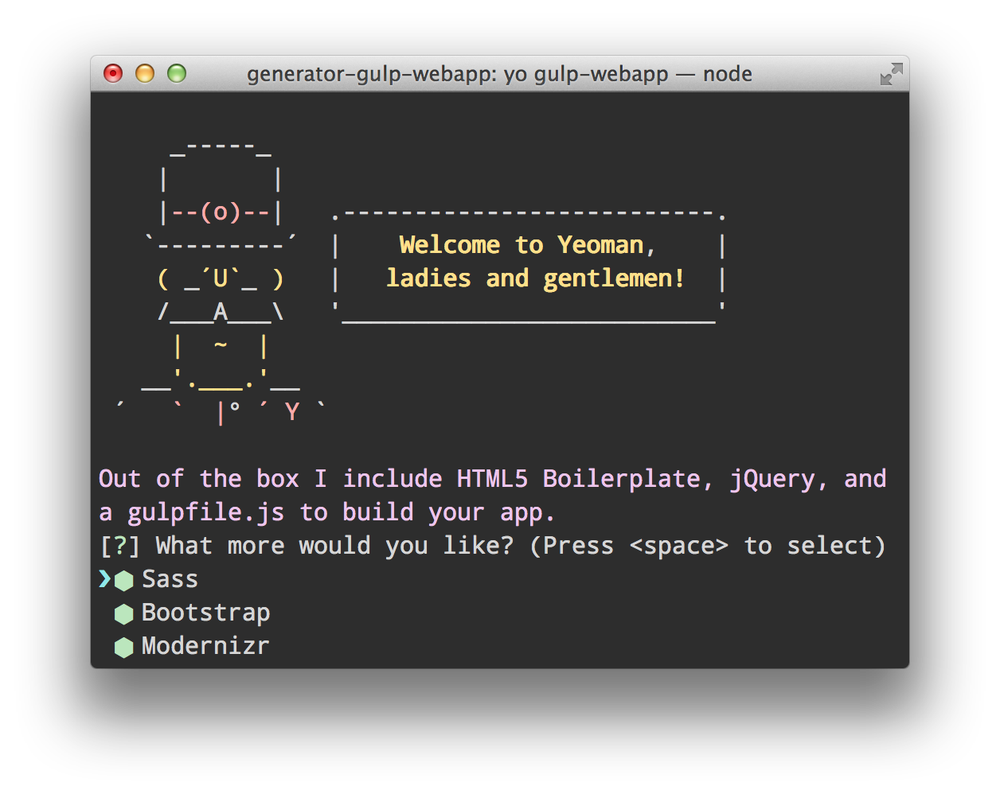

# Web app generator 

> [Yeoman](http://yeoman.io) generator that scaffolds out a front-end web app using [gulp](http://gulpjs.com/) for the build process

## Features

Please see our [gulpfile.js](app/templates/gulpfile.js) for up to date information on what we support.

* CSS Autoprefixing
* Built-in preview server with livereload
* Automagically compile Sass
* Automagically lint your scripts
* Awesome image optimization
* Automagically wire-up dependencies installed with [Bower](http://bower.io) *(when `gulp watch` or `gulp wiredep`)*

*For more information on what this generator can do for you, take a look at the [gulp plugins](app/templates/_package.json) used in our `package.json`.*

## Getting Started

- Install: `npm install -g generator-gulp-webapp`
- Run: `yo gulp-webapp`
- Run `gulp` for building to the `dist` directory and `gulp serve` for preview

#### Third-Party Dependencies

*(HTML/CSS/JS/Images/etc)*

To install dependencies, run `bower install --save package-name` to get the files, then add a `script` or `style` tag to your `index.html` or another appropriate place.

## Docs

* [recipes](docs/recipes/README.md) for integrating other popular technologies like CoffeeScript
* [details](docs/bower.md) about our Bower setup

## Options

- `--skip-install`
  Skips the automatic execution of `bower` and `npm` after scaffolding has finished.

- `--test-framework=<framework>`
  Defaults to `mocha`. Can be switched for another supported testing framework like `jasmine`.

## Contribute

See the [contributing docs](contributing.md).

## License

[BSD license](http://opensource.org/licenses/bsd-license.php)
